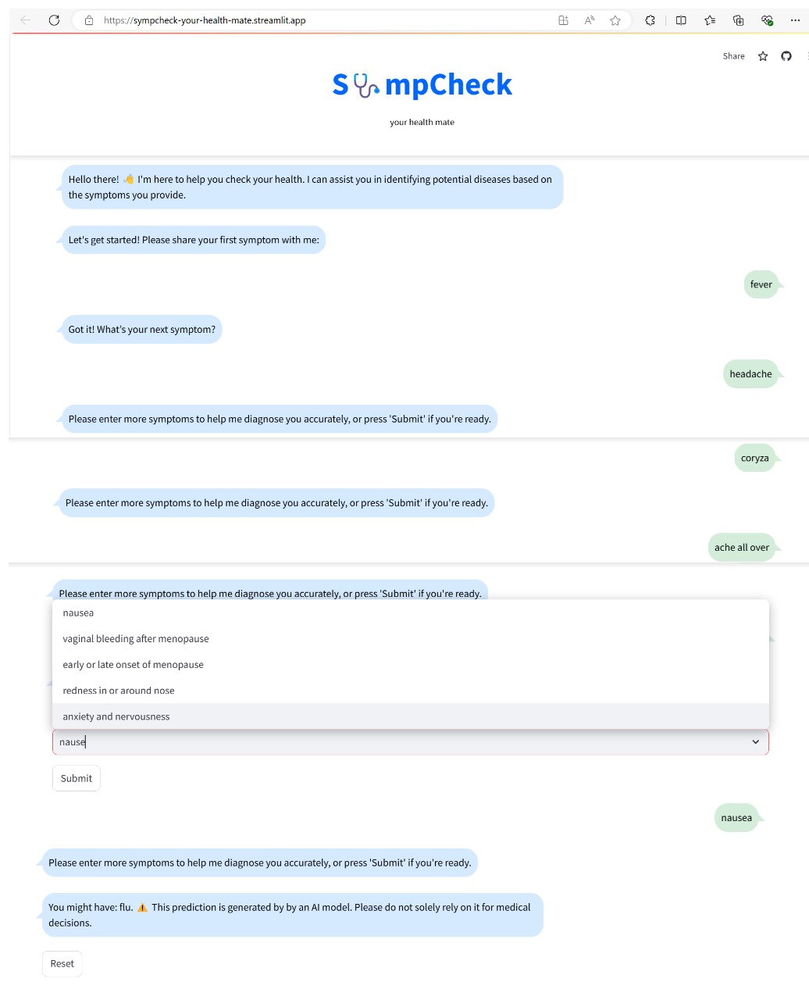

# SympCheck README

## Table of Contents
1. [Overview](#1-overview)
2. [Design Document](#2-design-document)
3. [Architecture Document](#3-architecture-document)
4. [Configuration](#4-configuration)
5. [Setup Instructions](#5-setup-instructions)
   - 5.1 [Prerequisites](#51-prerequisites)
   - 5.2 [Installation](#52-installation)
   - 5.3 [Run the Streamlit App](#53-run-the-streamlit-app)
6. [Usage](#6-usage)

## 1. Overview
SympCheck is a health diagnostic tool that identifies potential diseases based on user-provided symptoms. The project leverages natural language processing (NLP) techniques combined with a machine learning model to deliver accurate predictions through a user-friendly interface built with Streamlit.

## 2. Design document

Please refer to the [Design Document](../docs/architecture.md).

## 3. Architecture document

Please refer to the [Architecture Document](../docs/development.md).

## 4. Application Access

Here, you can access the application without setup in your local machine.

- **Sympcheck Production**: https://sympcheck-your-health-mate.streamlit.app/
- **Sympcheck TestNet**: https://sympcheck-testnet.streamlit.app/


## 5. Setup Instructions

### 5.1. Configuration
The API URL can be configured in `app/utils/config.py`.

### 5.2 Prerequisites
- Python 3.7 or higher
- Virtual environment (optional but recommended)
- Streamlit

### 5.3 Installation

- **Streamlit Setup**

First setup the streamlit
Follow the [Streamlit installation guide](https://docs.streamlit.io/get-started/installation/anaconda-distribution) to set up Streamlit using Anaconda distribution.


- **Clone the Repository:**
```sh
git clone https://github.com/yourusername/SympCheck.git
cd SympCheck
```
- **Install the Required Dependencies:**

```sh
pip install -r requirements.txt
```

### 5.4. Run the Streamlit App:
```sh
streamlit run app/pages/main.py
```
- If you encounter a "module not found" error even after installing all the libraries from requirements.txt, set the Python path:

```sh
$env:PYTHONPATH="$env:PYTHONPATH;."

```
## 6. Backend Project Setup

Next setup the backend service
Follow the [Backend installation setup](https://github.com/Venkatalakshmikottapalli/SympCheckBackend/blob/main/README.md)


## 7. Usage
After setting up, you can access the SympCheck app in your web browser at http://localhost:8501.

