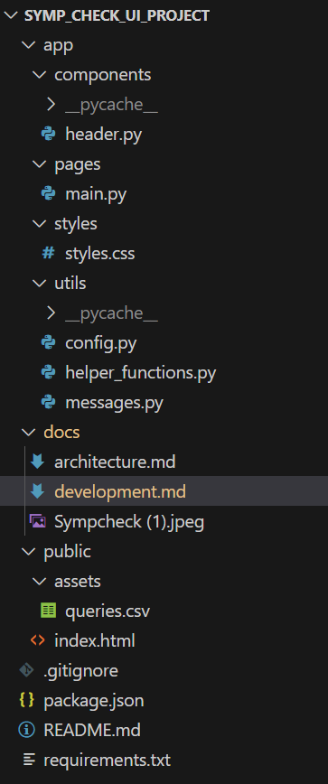
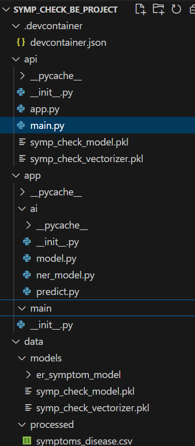
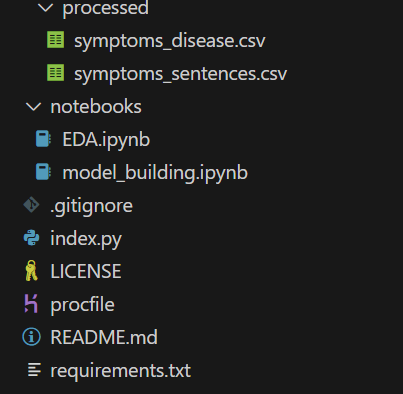
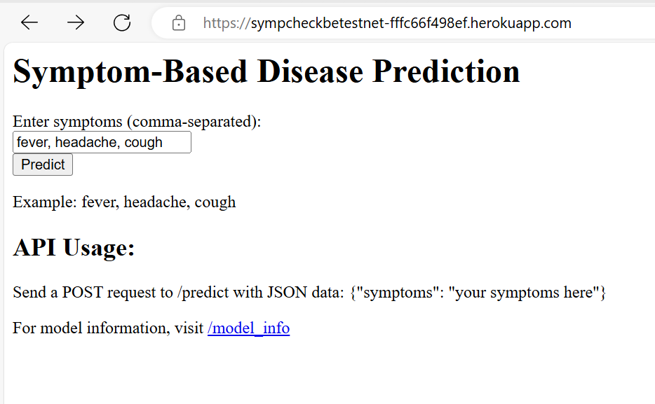

# SympCheck Design Document

## Table of Contents
1. [Overview](#1-overview)
2. [Design Principles](#2-design-principles)
3. [System Overview](#3-system-overview)
   - 3.1 [System Components](#31-system-components)
   - 3.2 [Architecture Flow](#32-architecture-flow)
4. [Implementation Strategy](#4-implementation-strategy)
   - 4.1 [Technology Stack](#41-technology-stack)
   - 4.2 [Development Workflow](#42-development-workflow)
   - 4.3 [Deployment Process](#43-deployment-process)
   - 4.4 [Project Directory Structure](#44-project-directory-structure)
   - 4.5 [Environments](#45-environments)
     - 4.5.1 [Development Environment](#451-development-environment)
     - 4.5.2 [Testing Environment](#452-testing-environment)
     - 4.5.3 [Production Environment](#453-production-environment)
   - 4.6 [API Endpoints](#46-api-endpoints)
5. [Testing and Validation](#5-testing-and-validation)
   - 5.1 [Unit Testing](#51-unit-testing)
   - 5.2 [Integration Testing](#52-integration-testing)
   - 5.3 [User Acceptance Testing](#53-user-acceptance-testing)
6. [Security and Privacy Considerations](#6-security-and-privacy-considerations)
   - 6.1 [Data Security](#61-data-security)
   - 6.2 [User Privacy](#62-user-privacy)
7. [Conclusion](#7-conclusion)

## 1. Overview
SympCheck is an intelligent chatbot designed to diagnose diseases based on user-provided symptoms. The project integrates natural language processing (NLP) techniques with a machine learning model deployed via a Flask API, with a user interface built using Streamlit.

## 2. Design Principles
- **User-Centric Design**: Provides an intuitive and interactive interface for seamless user interaction.
- **Scalable Architecture**: Modular design ensures easy maintenance and future expansion.
- **Efficient Processing**: Leverages NLP for quick and accurate disease predictions.
- **Responsive Feedback**: Delivers predictions to enhance user experience.
- **Robust Session Management**: Maintains state to ensure consistent interactions.

## 3. System Overview

### 3.1 System Components

#### 3.1.1 User Interface (UI)
- **SympCheck Chatbot UI**: The user interacts with the system through the SympCheck chatbot UI, which is hosted on Streamlit. The chatbot allows users to input their symptoms in a conversational format.
- **Deployment**: The chatbot UI is deployed on Streamlit, ensuring an accessible and user-friendly interface.

#### 3.1.2 Backend Service
- **Flask API**: The backend is built using Flask. The API processes user input and returns the predicted disease.
- **Logistic Regression Model**: A trained Logistic Regression model is integrated into the Flask API for predictions.
- **Deployment**: The Flask API and model are hosted on Heroku for scalability and reliability.

#### 3.1.3 Continuous Integration/Continuous Deployment (CI/CD)
- **CI/CD Pipeline**: Automated deployment processes are implemented separately for UI and Backend. Below are the pipelines
- Backend Pipeline: sympcheckbepipeline
- UI Pipeline: streamlit default pipeline 

#### 3.1.4 Model
- **Data Preparation**: Involves data acquisition, preprocessing, and feature extraction. Please refer to the [Exploratory Data analysis](https://github.com/Venkatalakshmikottapalli/SympCheckBackend/blob/main/notebooks/EDA.ipynb)
- **Model Training and Selection**: Models are trained and validated before deployment.
Please refer to the [Module Building](https://github.com/Venkatalakshmikottapalli/SympCheckBackend/blob/main/notebooks/model_building.ipynb)
- **API Integration with Model**: Model is integrated with API. Please refer to the [API Integration with Model](https://github.com/Venkatalakshmikottapalli/SympCheckBackend/blob/main/api/main.py)

### 3.2 Architecture Flow
The system loosely follows the MVC pattern, with the Streamlit app serving as the View, the Flask API as the Controller, and the NLP model/data as the Model.

### 3.2.1 Architecture Document Reference
For a detailed description of the system architecture, please refer to the [SympCheck Architecture Document](architecture.md).

## 4. Implementation Strategy

### 4.1 Technology Stack
- **Frontend**: Streamlit
- **Backend**: Flask, joblib
- **Machine Learning**: Scikit-learn, Pandas, Logistic regression
- **CI/CD**: GitHub, Heroku
- **Platforms**: Heroku, Streamlit 
- **Python**: Refer to the [Python Libraries](../requirements.txt)

### 4.2 Development Workflow
- **Version Control**: GitHub is used for version control and collaboration.
- **Branching Strategy**: Development and production branches are used to maintain the strategic environments for development and review.
#### 4.2.1. Sympcheck UI
- **Repository**: SympCheck
- **Branches**: Here, we have 'master' and 'develop' branches used respectively for 'production' and testnet environments 
#### 4.2.2. Sympcheck Backend
- **Repository**: SympCheckBackend
- **Branches**: Here, we have 'main' and 'develop' branches used respectively for 'production' and testnet environments 

### 4.3 Deployment Process
- **CI/CD Pipeline**: Automated deployment to Streamlit (UI) and Heroku (backend).

### 4.4 Project Directory Structure
The project follows a structured directory layout to maintain organization and facilitate development:

#### 4.4.1 UI Project Directory

#### 4.4.2 Backend Project Directory

### 4.5 Environments
#### 4.5.1 Development Environment
- **Local Setup**: Developers set up a local environment with necessary dependencies using the `requirements.txt` file. 
Please refer to the [Local Setup Guide](../README.md).
- **Tools**: Streamlit and Flask are run locally for development and Unit testing.

#### 4.5.2 Testnet Environment
- **Staging**: A separate staging environment mimics production for testing purposes.
- **Staging URL**: https://sympcheck-testnet.streamlit.app/
- **Automated Tests**: CI/CD pipelines automated for deploying to testnet environment.

#### 4.5.3 Production Environment
- **Production**: The application is deployed on Heroku for the backend and Streamlit for the frontend.
- **Production URL**: https://sympcheck-your-health-mate.streamlit.app/
- **Monitoring**: Continuous default monitoring in place to ensure application performance and uptime.

### 4.6 API Endpoints
The following API endpoints are available in the SympCheck application:

- **Production API URL**:'https://sympcheckbe-88b42835620c.herokuapp.com' 
- **Testnet  API URL**:'https://sympcheckbetestnet-fffc66f498ef.herokuapp.com' 

| Endpoint         | Method | Description                                      |
|------------------|--------|--------------------------------------------------|
| `/predict`       | POST   | Accepts symptoms and returns predicted disease.  |
| `/`              | GET    | It provides the individual UI for API testing.   |

#### 4.6.1. API Usage:

## 5. Testing and Validation

### 5.1 Unit Testing
Unit tests are written to validate the functionality of individual components in local environment

### 5.2 Quality Assurance/ User Acceptance Testing
QA and User acceptance tests are conducted to validate the system from the end-user perspective in the testnet environement.

## 6. Security and Privacy Considerations
### 6.1 User Privacy
- **Data Minimization**: Only essential data is collected and processed.
- **Compliance**: The system adheres to data privacy regulations, ensuring user data is not stored 

## 7. Conclusion
This design document outlines the architecture, implementation strategy, testing, and security considerations for the SympCheck application. The structured approach ensures scalability, maintainability, and security in the system.
